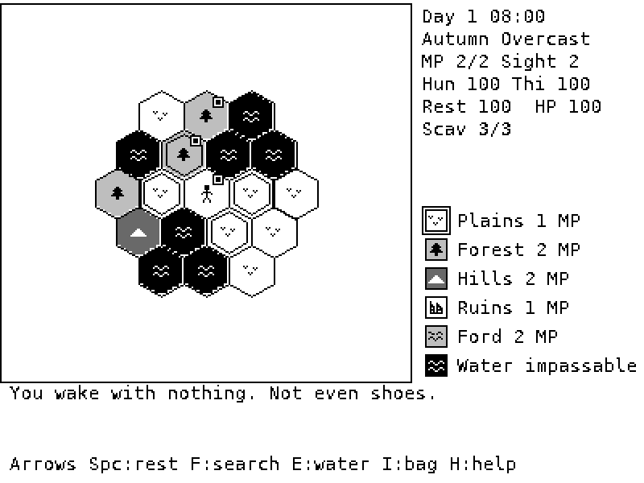

# The Churn on a PC or Raspberry Pi

A pygame window that runs the real game, `../churn.lua`, unchanged.

The game is written for SolarOS, the handheld's OS, which gives Lua apps a
`solaros` module for the screen, keys, storage and sound.
`churn_pygame.py` provides that module from Python: [lupa](https://pypi.org/project/lupa/)
runs the Lua 5.4 game, and its drawing goes to a 400x300 canvas shown scaled up in a window.
So it plays exactly like the device, and any change to the Lua game shows up
here with no Python work.



## Install with one command

The installers clone the game, check for Git and Python 3.8+ (and offer to
install them), get the DejaVu fonts, set up pygame and lupa in their own
folder, start a quick test game without a window, and make a launcher.
Run one again any time to update the game.

**Linux and Raspberry Pi OS** (uses apt, dnf, pacman or zypper with sudo when something is missing):

```sh
curl -fsSL https://raw.githubusercontent.com/gabecamp/solar_os/main/examples/churn/python_version/install.sh | bash
~/the-churn/play.sh
```

**Windows** (PowerShell; uses winget when Git or Python is missing):

```powershell
irm https://raw.githubusercontent.com/gabecamp/solar_os/main/examples/churn/python_version/install.ps1 | iex
```

Then use the **The Churn** shortcut on the desktop or in the Start menu,
or `~\the-churn\play.bat`.

From a downloaded copy instead: `bash install.sh` or
`powershell -ExecutionPolicy Bypass -File install.ps1`. Options:

| install.sh | install.ps1 | What it does |
|---|---|---|
| `--dir DIR` | `-Dir DIR` | Where the game goes. The default is `~/the-churn`. |
| `--branch NAME` | `-Branch NAME` | Which branch to install. The default is `main`. |
| `--no-system` | `-NoSystem` | Never install system packages; just say what's missing. |
| `--yes` | `-Yes` | Don't ask before installing anything. |

## Install by hand

You need Python 3.8 or newer, pygame and lupa. The DejaVu fonts make the text
line up like on the device. `requirements.txt` asks for **pygame-ce**, the
community edition of pygame: the same `import pygame`, and it has ready-made
builds for the newest Pythons (classic pygame 2.6.1 stops at 3.13; on 3.14
pip tries to compile it and fails on Windows). Classic pygame works too.

**Windows, macOS, Linux:**

```sh
cd examples/churn/python_version
pip install -r requirements.txt
python3 churn_pygame.py
```

**Raspberry Pi (Raspberry Pi OS, a Pi 3B+ or newer):**

```sh
sudo apt install python3-pygame python3-venv fonts-dejavu-core build-essential
cd examples/churn/python_version
python3 -m venv --system-site-packages ~/churn-venv
~/churn-venv/bin/pip install lupa
~/churn-venv/bin/python churn_pygame.py --fullscreen
```

On 64-bit Raspberry Pi OS, lupa installs from a ready-made wheel. On 32-bit,
pip builds it from source. That needs `build-essential` and takes a few
minutes on a Pi 3B+, once.

## Options

| Option | What it does |
|---|---|
| `--scale N` | Window size: 400x300 times N. The default is 2 (800x600). |
| `--fullscreen` | Fill the screen with the largest whole scale, centered. Good for a TV or a 7" panel. |
| `--look gray` | The default: four flat grays. |
| `--look device` | The handheld's 1-bit reflective LCD, the same dither as the firmware. |
| `--look amber`, `--look green` | Old terminal tints. |
| `--mute` | No sound. The game's own **M** key also mutes. |
| `--data DIR` | Where saves and records go. The default is `~/.local/share/the-churn`, or `%APPDATA%\TheChurn` on Windows. |
| `--game FILE` | Run another build of the game; the default is `../churn.lua`. |

## Keys

The same as on the device; **H** in the game lists them all.

- **Moving:** Left/Right step west or east. Up or Down, then Left/Right, takes a diagonal. WASD works the same.
- **Actions:** Space rests, F searches, E uses or drinks, I opens the bag, C crafts, J opens the journal, T trades.
- **Quit:** Q on the map, or close the window.

The game saves when you quit, and the title screen offers **Continue** next time.

## Notes

- **Updating:** update the game by updating `../churn.lua` (or rebuild it from
  `../src` with `python3 ../tools/build.py`). This folder never needs to change for that.
- **Errors:** if the game hits an error, the window shows it, and so does the terminal.
  Please send me both.
- **Tests:** `python3 ../tests/pygame_host_test.py` runs the host headless, and the
  game's test suite (`bash ../tests/run_tests.sh`) runs it too when pygame and lupa are installed.
- **History:** the earlier pygame prototype that used to live in this folder (an isometric
  1024x600 version from before the Lua game) is in the git history, before this commit.
