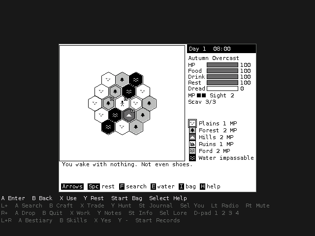

# The Churn on an Anbernic RG350 (OpenDingux) and other SDL 1.2 handhelds

`churn_sdl.c` is a small C program that runs the real game, `../churn.lua`,
unchanged. It gives the game the `solaros` module it expects (screen, keys,
storage, sound), the same way `../python_version/churn_pygame.py` does on a PC.
Lua 5.4 is built into it; the only thing it needs from the handheld is SDL 1.2,
which every OpenDingux device has. The 400x300 picture is centered, with the
button legend in the border:



**Status: built and tested on a PC (headless SDL, the real game, every button
path), and cross-built for the handheld with the 2014 GCW Zero OpenDingux
toolchain; that MIPS program was run under qemu with the SDK's own uClibc
and SDL 1.2 (key layers, and the real game drawing a frame). It has not been
run on a real handheld yet.**

## Buttons

L and R are shift keys: hold one and the face buttons and the D-pad become
other keys. The legend in the border lights up the layer you're holding.

| | none | hold **L** | hold **R** | **L + R** |
|---|---|---|---|---|
| **A** | Enter | F search | X drop | B bestiary |
| **B** | Esc / back | C craft | Q quit (asks) | K skills |
| **X** | E use | T trade / camp | O work | Y yes |
| **Y** | Space (rest) | G hunt / fish | N notes | |
| **Start** | I bag / map | J journal | V device info | R records |
| **Select** | H help | P you (stats) | L lore | |
| **D-pad** | arrows | arrows, Left R radio, Right M sound | Up 1, Right 2, Down 3, Left 4 | arrows |

Every key the game uses can be reached. R + B is quit; Q then asks first
during a run, and your run is saved either way. A keyboard (an emulator on a
PC, say) works too: letters and digits are themselves. `--pc-keys` makes
Return, Esc and Space themselves as well.

## Screens

The program uses the video mode the handheld is in, and the biggest whole
scale of the 400x300 picture that fits: 1x on the RG350's 640x480. On a
320x240 screen (RG280V and the like) the picture is shrunk to fit, which
works but gives uneven pixels. Options: `--size WxH`, `--scale N` (0 = fill
the screen), `--no-legend`, `--mute`.

## If it won't open

The package starts the game through `churn.sh`, which writes what happened
(the firmware's libraries, each start-up step, any error) to `churn_log.txt`
in the root of the SD card (and in the home folder). Read it on a PC and
send it along. Firmware note: OpenDingux Beta (2022 and later) is built on
uClibc-ng 1.0.x, newer than the 2014 toolchain the program is built with;
if the log shows the program can't start, it needs a build with the Beta SDK
(`configs/od_gcw0_defconfig` in github.com/OpenDingux/buildroot).

## Where things go

Saves and records are in `~/.the-churn` (or `$CHURN_DATA`), so the game file
can be replaced without touching them. There is no Wi-Fi code, so the game's
"update on open" prompt doesn't appear here: replace `churn.lua` instead
(download it from GitHub, or rebuild the OPK).

## Building

On a PC (to try it, or to work on it): `sudo apt install libsdl1.2-dev
liblua5.4-dev python3-pil fonts-dejavu-core`, then `make` and `make test`.
`make test` runs the real game headless through a few keys, pushes fake
button presses through the key code, and checks a broken game file is
reported.

For the handheld you need the OpenDingux SDK (a cross compiler for the MIPS
chip plus the handheld's SDL libraries). The one used here is the 2014 GCW
Zero toolchain (the original download is gone; the Wayback Machine has it:
`https://web.archive.org/web/20200804143457/http://www.gcw-zero.com/files/opendingux-gcw0-toolchain.2014-08-20.tar.bz2`,
144 MB). It runs on 32-bit x86 (`sudo apt install libc6-i386` on a 64-bit
Linux) and expects to be at `/opt/gcw0-toolchain`:

```sh
sudo mkdir -p /opt && sudo tar xjf opendingux-gcw0-toolchain.2014-08-20.tar.bz2 -C /opt
TOOLCHAIN=/opt/gcw0-toolchain/usr ./build_opk.sh
```

`build_opk.sh` looks for `bin/*-gcc` and an `sdl-config` under that folder, downloads
and builds Lua 5.4, links it all into one program, and packs `churn.opk`
(a squashfs with the program, `churn.lua`, the icon and the launcher entry).
Copy the `.opk` to the SD card's `apps` folder, or install it from the
handheld's file manager.

**Or let GitHub build it.** `.github/workflows/churn-rg350.yml` tests the
program on every change and cross-builds `churn.opk` with that same
toolchain (downloaded from the Wayback Machine and cached), checks it is a
MIPS program and runs it under qemu. The file is the run's `churn-rg350-opk`
artifact and, from `main`, the `churn-rg350` release. To use another SDK, set
the repository variable `OPENDINGUX_TOOLCHAIN_URL` (Settings, Secrets and
variables, Actions, Variables) or paste a link in the "toolchain_url" box when
starting the workflow by hand.

Fonts: `make_font.py` bakes DejaVu Sans Mono (the PC port's fonts) into
`font_data.h`, so neither SDL_ttf nor FreeType is needed on the device. The
fonts' licence is in `DejaVu-LICENSE.txt`.
